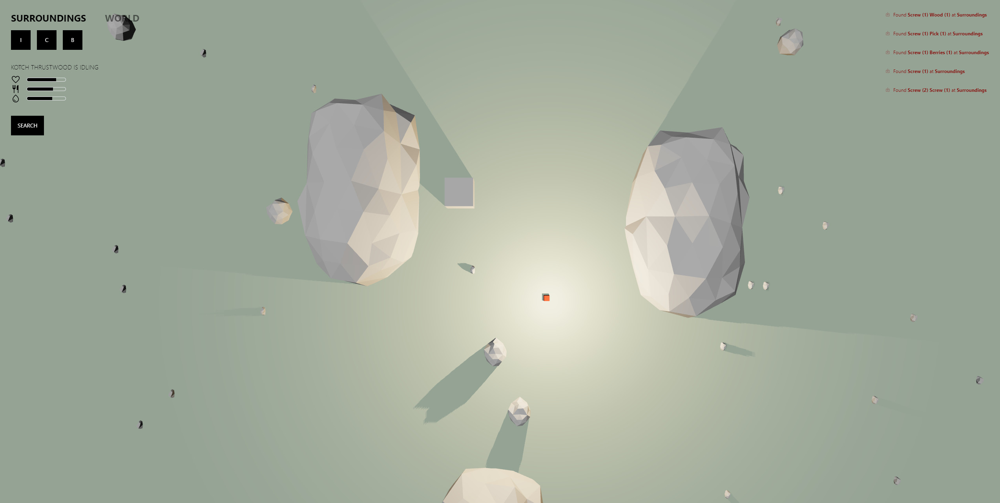

 

### Fiber Demo

   

  

   

---

 

## About

Demo showcasing multi user interactive environments on the web. Build and survive in an idler style experience with other users in an ever expanding world.

Explore, scavenge and raid a host of procedurally generated and user created worlds.

### Built With

- [React](https://github.com/facebook/react)
- [React-three-fiber](https://github.com/pmndrs/react-three-fiber)
- [Tailwind](https://github.com/tailwindlabs/tailwindcss)

   

## License

See [LICENSE](LICENSE) for more information.

   

